[TOC]

# BIM部署文档

##    一、新建数据库

**具体的数据库服务器地址根据实际情况修改，这里以` 47.103.110.240`为例说明,平台的数据库为sql server  **

- 登陆数据库平台：

  ​		window 环境中，键盘选择 `window` +`R`  , 输入命令 ：mstsc

   


​		点击确认，弹出远程桌面链接，输入服务器IP地址，用户名和密码进入数据库服务器：

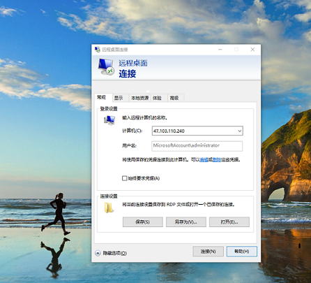

​		打开数据库管理工具，连接数据库

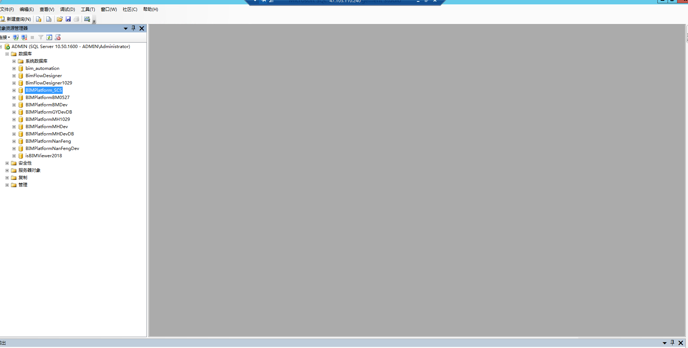

- 创建数据库	

​	选中 `数据库` —— 右键`新建数据库` 

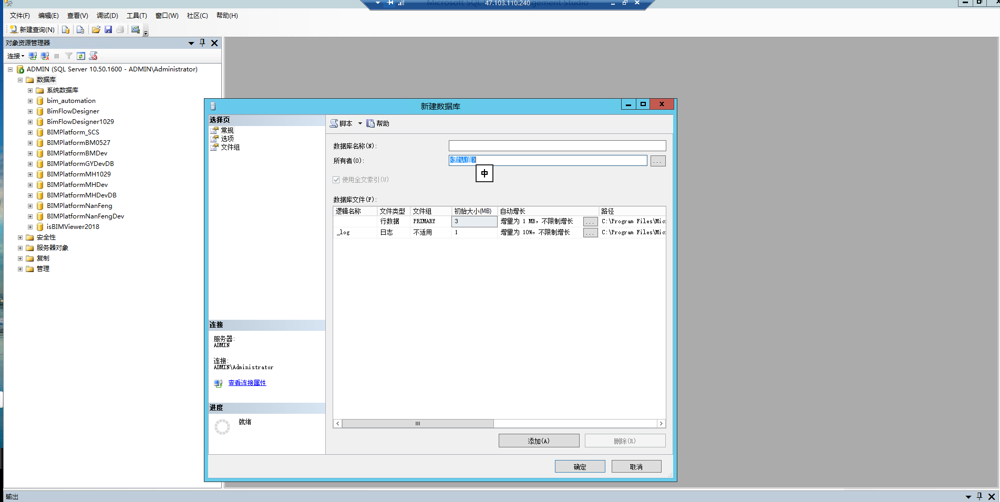

​		输入新数据库的名称，确定，完成新数据库的创建，或者 `新建查询` —— 输入脚本

```
create database databaseName
```

 完成创建

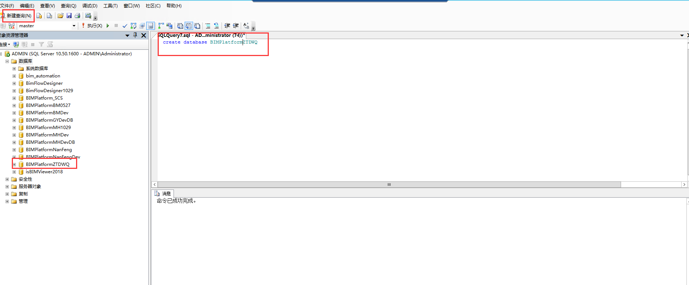

- 获取脚本和创建基本数据库表结构：


​		目前平台的数据库架构没有成熟的脚本，可根据原有的平台的数据库导出相应的脚本文件，这里以 `BIMPlatform_SCS` 数据库为例演示。

​		`右键`——`任务`——`生成脚本`  

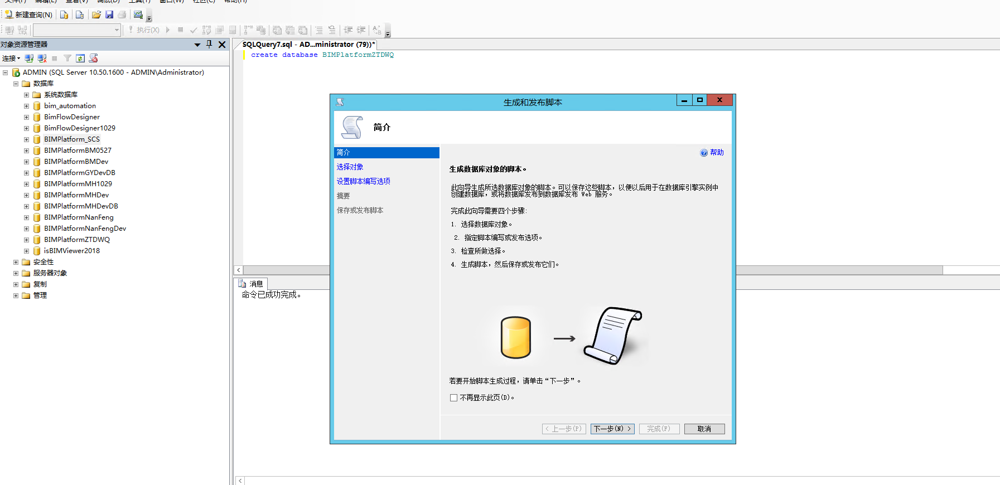

​		下一步 —— 选择特定数据库对象——表

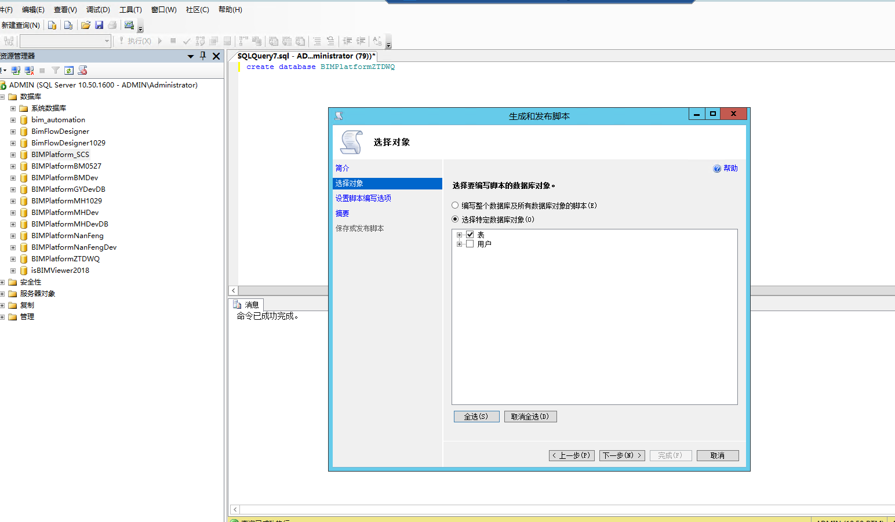		下一步——高级——常规——要编写的脚本的数据类型， 这里选择仅限架构，下一步**这里需要注意记住你的文件地址，待会需要用到** 

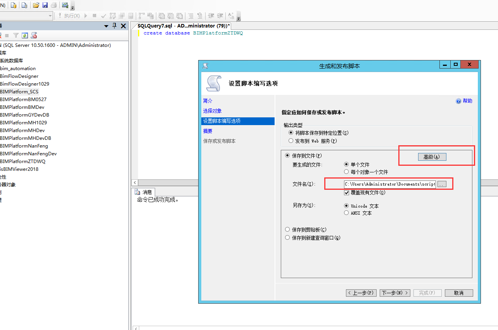

​	打开刚才创建的脚本，复制到查询页面中，当前数据库选择刚新建的数据库，删除第一行的数据库use命令，并执行sql ,完成创建数据库表

  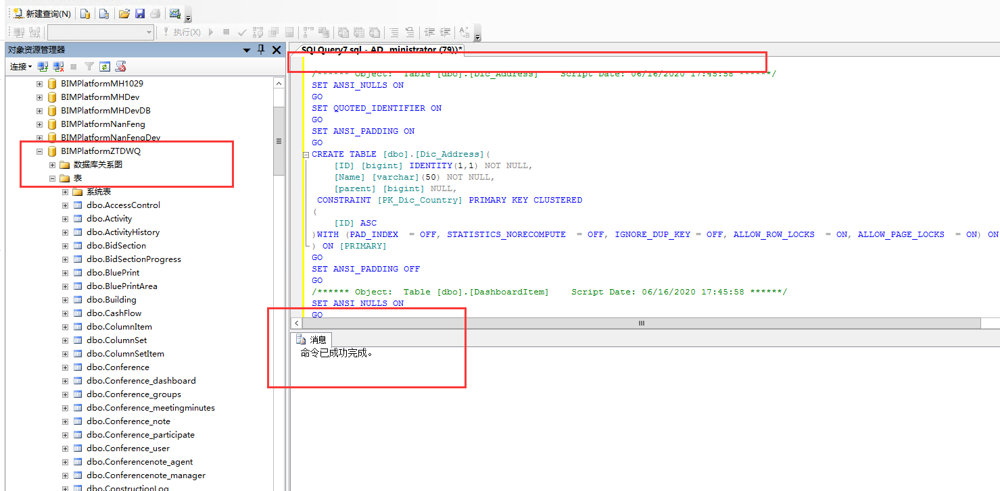

- 创建数据库用户

  点击安全性——登录名——选择imuser——右键选择属性——用户映射，在影射到此登录名的用户，勾选新建的数据库名称，点击确定，保存。

  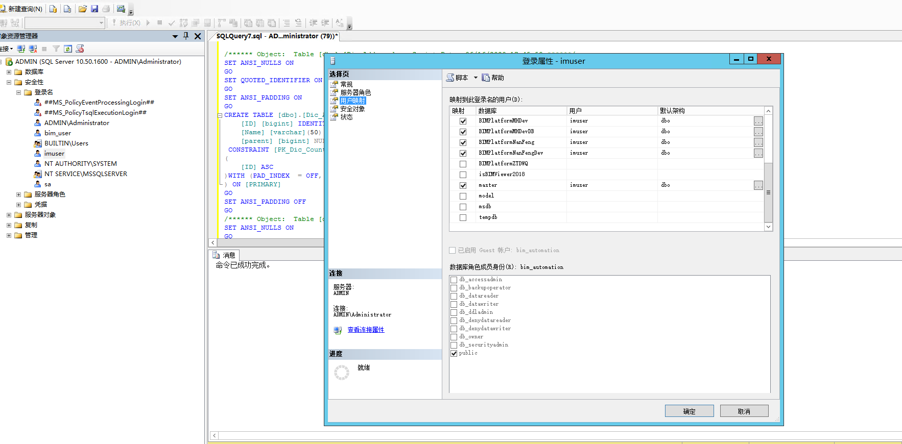

  再次查看BIMPlatformZTDWQ 下的安全性——用户，已存在新的用户Imuser.

- 分配数据库用户的的角色

  ​		选中用户，将db-owner 分配给用户

  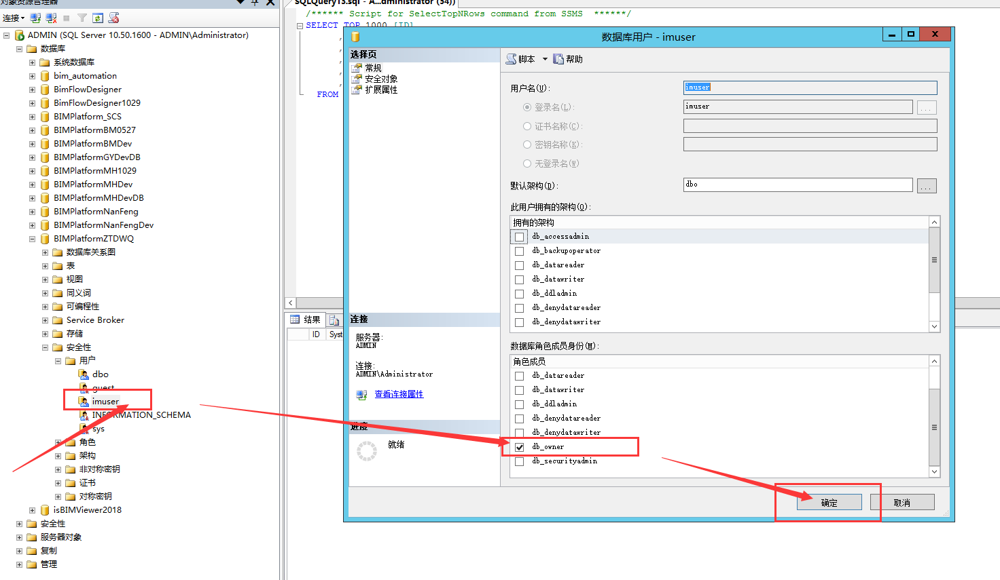

##  二、发布web 网站

​		重新生成后端项目，修改web.config中的数据库链接，然后生成前端项目，将BIMPlatform.ClientProjects中生成的文件 拷贝到web服务器上，打开IIS 

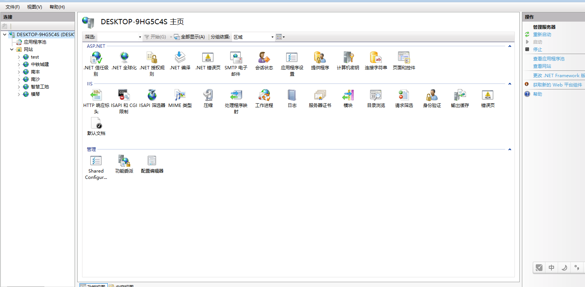

​		网站—— 右键—— 添加网站，输入网站名称，物理路径选择刚拷贝的文件的路径，输入端口

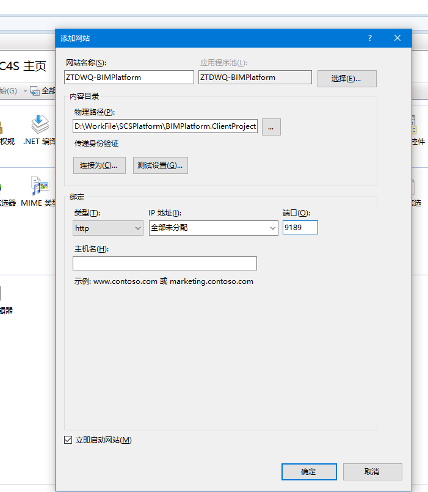


​			点击确定，完成部署，返回IIS， 选择刚才创建的网站，点击浏览

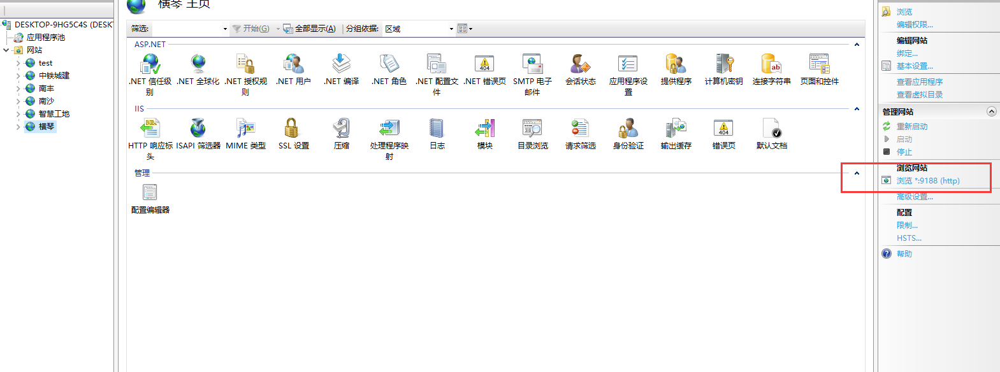


##  三、平台配置

​		平台的基本数据有菜单、权限、角色，平台的配置基于配置工具，打开配置工具,点击运行  .exe：

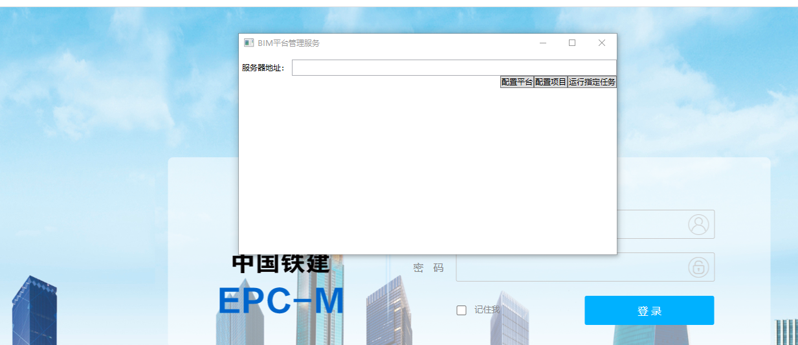

​		服务器地址一栏中输入部署的web地址，点击`配置平台` ：

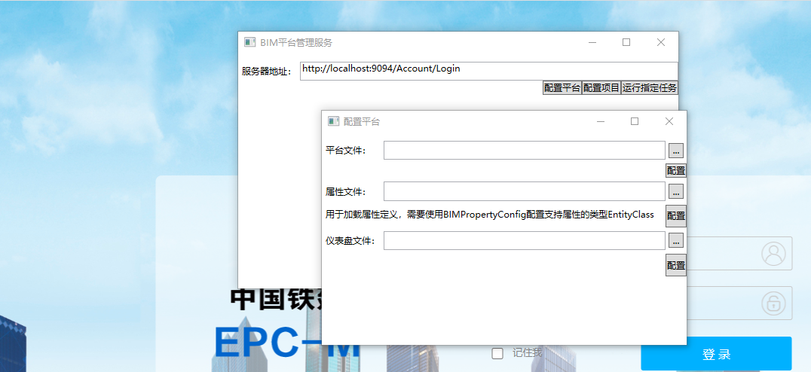

下面分别说明配置权限，菜单、角色、初始化管理员，项目等基础信息配置

- 配置权限

  点击 	`...`	 选择 `NSPlatform-Permission.xml`   ——	`打开` ，然后选择下方的	`配置`按钮，

- 配置菜单

  点击 	`...`	 选择 `NSPlatform-Menu.xml`   ——	`打开` ，然后选择下方的	`配置`按钮，

- 配置角色

  点击 	`...`	 选择 `NSPlatform-UserRole.xml`   ——	`打开` ，然后选择下方的	`配置`按钮，

- 配置用户

  点击 	`...`	 选择 `NSPlatform-UserRole.xml`   ——	`打开` ，然后选择下方的	`配置`按钮，

- 配置项目

  使用新创建的用户登陆平台，admin (默认密码为admin) ，进入`系统设置` —— `项目信心管理`模块，选择添加项目，完成初始化项目的配置

- 配置文件夹

   项目启动前，修改配置文件	`DefaultFolderStructure.xml` 

  